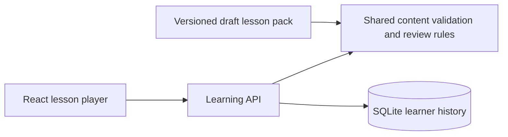

# Project kickoff — first learning slice

The first implementation is a local family prototype: one practical lesson per target language, plus a child adaptation. It establishes the content contract, lesson player, learner separation, and progress persistence before the remote authoring and hosting work.

The child audience is now **a five-year-old Chinese speaker beginning Japanese**. Reading ability has not been specified, so the child variant assumes an adult reads the Chinese guidance aloud. Activities use pictures and tap answers; typing and independent script reading are not prerequisites. Spoken repetition is optional and is not recorded or graded.

## Architecture decision

Use React and TypeScript with Vite for the responsive interface. An Express API uses the same TypeScript content contract and grading/review functions. Node 24's built-in SQLite stores learning history on the machine running the API. This keeps the first slice small and gives a future MCP adapter a shared application service to call.

No paid service or API key is needed. This is a single-family development prototype. The learner switch is a convenience, not authentication. The API listens on loopback; authenticated family access, hosting, backups, and cross-device operation remain future work. SQLite persistence survives server restarts, but a local database is not a backup service.

## What works in this slice

- Today, Explore, My notebook, and learner settings, with English/Chinese interface and explanation switching.
- Adult beginner English and Japanese lessons for asking for a drink politely.
- Chinese-guided Japanese listening/picture practice for a five-year-old, with every attempt recorded as assisted recognition.
- Separate learner histories; adding learners; switching target languages for adults.
- Saved intro/practice/feedback/completion state, including exact feedback on resume.
- Reviewed-answer matching, bounded error explanations, hints, and explicit assistance tracking. Sample answer sets still need human language review.
- A notebook of patterns from started lessons.
- Review of due exercises: mistakes and unrecognized answers return after ten minutes; correct assisted work after one day; correct independent work starts at two days and doubles to a thirty-day cap. These are prototype defaults, not validated pedagogy.
- Versioned attempt history and idempotent answer submission. A changed pack revision requires an explicit lesson restart and retains earlier attempts.

The browser previews audio using an available **local device voice**. If the required voice is absent or playback fails, it offers a clear fallback. There are no reviewed audio recordings yet. This does not satisfy the design brief's acceptance case involving an imported real audio asset.

## Content contract

`content/material-pack.schema.json` exports schema version `0.1.0`. `shared/content.ts` is its source. The sample pack is `content/polite-requests.json`: revision 1, three lesson variants, nine exercises.

Each lesson has stable IDs, audience, target language, Chinese/English objectives and explanations, a pattern, a scene, audio provenance, and typed activities. Choice activities declare pictured options and an accepted option ID. Text activities declare reviewed alternatives and specific known errors. Semantic validation also checks ID uniqueness, answer references, and the child activity restrictions; JSON Schema alone does not check those relationships.

Unknown typed answers receive “Compare with the example” rather than a claim that they are grammatically wrong. Recognition and text production are separate evidence. Correct assisted answers never count as independent recall. Switching explanation language changes presentation, not the history.

The contract intentionally permits only draft packs and unreviewed device-speech previews in this version. Publication and real media assets need a deliberate next contract revision, including verified media metadata and review gates. Do not silently label sample content as published.

## Next milestones

1. Review the actual English/Japanese language content and the child lesson with the family. Check that the five-year-old enjoys and understands the pictured choices and caregiver guidance.
2. Add reviewed audio and image asset records, MIME/checksum validation, and a real upload path. Keep content facts separate from adult/child presentation.
3. Add the MCP adapter against the first chosen agent client: context read, search, draft import/update, validation, asset attachment, and publication. Preserve idempotency, expected revisions, shared validation, and explicit review status. MCP tools are not implemented in this slice.
4. Choose the family's sign-in, hosting, durable storage, and backup arrangement. Implement authenticated access before exposing the API externally.
5. Run the design brief's full acceptance case: an external agent imports a lesson with real audio, the learner plays it, a mistake enters review, and replay/resume require no model-generation request.

The working name is Trilinguo. The frontend and backend choices are documented defaults for this kickoff; the original design brief remains unchanged.
